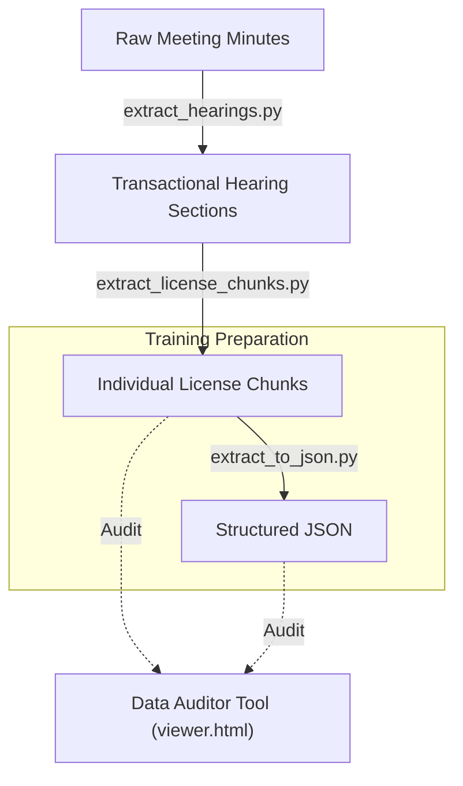

# Licensing Board Finetune

This project provides a robust pipeline for extracting and processing "Transactional Hearing" data from Licensing Board meeting minutes into a structured format suitable for **LLM Finetuning**.

## 🎯 The Core Concept: LLM Finetuning Data

The primary goal of this repository is to transform messy, unstructured license board meeting minutes into high-quality training pairs. By creating a corpus of matching **Context (Text)** and **Label (JSON)** files, we can train Large Language Models (LLMs) to perform specialized extraction tasks with high precision.

- **`license_text/` (The Context)**: Raw text chunks extracted from meeting minutes containing the human-written description of a license transaction. This serves as the "Prompt" or "Input" for an LLM.
- **`license_json/` (The Ground Truth)**: Clean, structured metadata (Legal Name, DBA, Zip Code, Status) extracted from that text. This serves as the "Target" or "Completion" for training.

By training on thousands of these pairs, a finetuned model learns the specific domain language and idiosyncratic formatting styles of Licensing Board documents.

---

## 🛠️ Data Processing Pipeline

The pipeline follows a refinement process, moving from raw PDFs/Text to individual, structured data points.



| Order       | Script                        | Description                                                                               | Input                                | Output                          |
| :---------- | :---------------------------- | :---------------------------------------------------------------------------------------- | :----------------------------------- | :------------------------------ |
| **1** | `extract_hearings.py`       | Filters raw minutes to isolate only the "Transactional Hearing" sections.                 | `voting_minutes_txt/`              | `transactional_hearings_txt/` |
| **2** | `extract_license_chunks.py` | Splits long hearing sections into separate files for each individual license application. | `transactional_hearings_txt/`      | `license_text/`               |
| **3** | `extract_to_json.py`        | Parsers the text chunks into structured JSON using rule-based normalization.              | `license_text/`                    | `license_json/`               |
| **4** | `build_viewer.py`           | Generates `viewer.html` and manifest files to allow side-by-side auditing.              | `license_text/`, `license_json/` | `viewer.html`                 |

### 🔍 Audit & Exploration Tools

- **`viewer.html`**: A custom web tool to rapidly browse and compare `license_text` vs `license_json` to ensure the ground truth is accurate.
- **`eda_license_json.ipynb`**: A Jupyter notebook for exploratory data analysis, checking distribution of statuses and categories.
- **`infer_license_schema.py`**: A utility to analyze text regularities and suggest a common JSON schema for the dataset.

---

## 🚀 Usage

### 1. Run the Pipeline

You can run the entire extraction process using the provided shell script:

```bash
bash run_pipeline.sh
```

### 2. Audit the Results

To verify the extraction quality using the web viewer:

1. Ensure `manifest_orig.json` and `manifest_fix.json` are generated (via `build_viewer.py`).
2. Start a local server:
   ```bash
   python3 -m http.server
   ```
3. Open `http://localhost:8000/viewer.html` in your browser.

---

## 🏗️ Repository Structure

- `voting_minutes_txt/`: Source directory for raw text meeting minutes.
- `license_text/`: Chunks of text for individual license transactions.
- `license_json/`: Structured JSON metadata derived from text chunks.
- `license_text_fix/`: (Optional) Manual or programmatic corrections to text chunks.
