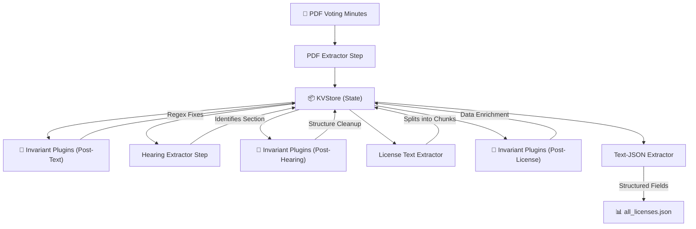
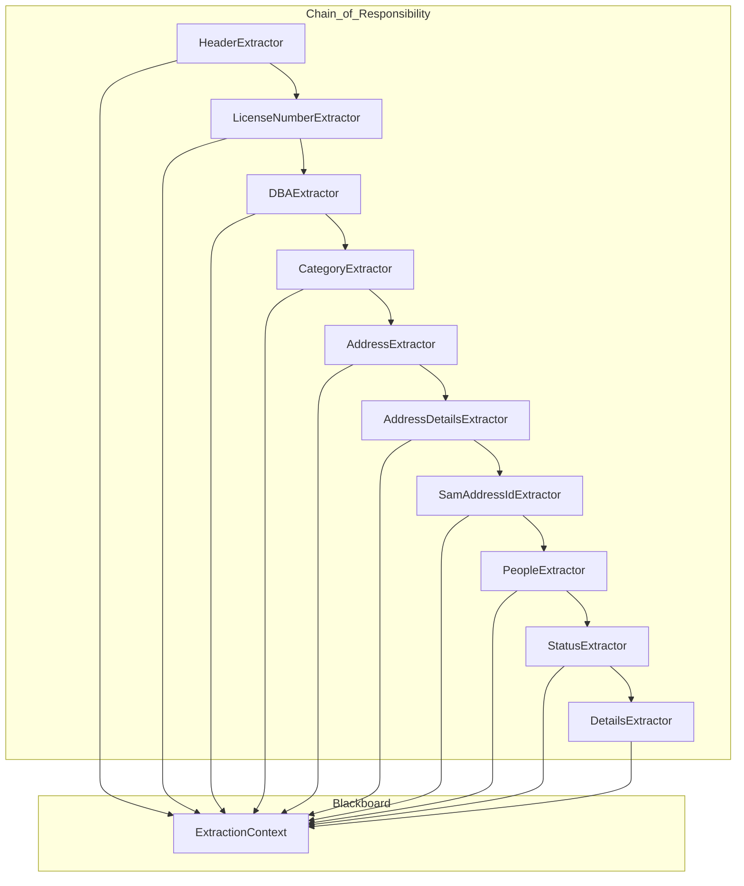

# Boston Licensing Board - Minutes to JSON Pipeline

This project provides a robust, highly efficient pipeline for extracting structured JSON data from PDF voting minutes issued by the City of Boston Licensing Board. It automates the transformation of unstructured legal records into actionable data using a pipeline-based architecture, a pluggable validation system, and precise regex-based extraction.

Extracted addresses are normalized and validated against Boston's **SAM (Street Address Management)** dataset, so each record is enriched with canonical SAM identifiers for reliable matching and deduplication.

## 🏗 Architecture

The application is built around a sequential pipeline orchestrated by a central `Pipeline` class and supported by a State Manager (`KVStore`). This approach ensures that processing stages are decoupled, auditable, and easily extensible via plugins.


```mermaid
graph TD
    PDF["📄 PDF Voting Minutes"] --> PE["PDF Extractor Step"]
    PE --> KVS["📦 KVStore (State)"]
  
    KVS --> IP1["🔌 Invariant Plugins (Post-Text)"]
    IP1 -- "Regex Fixes" --> KVS
  
    KVS --> HE["Hearing Extractor Step"]
    HE -- "Identifies Section" --> KVS
  
    KVS --> IP2["🔌 Invariant Plugins (Post-Hearing)"]
    IP2 -- "Structure Cleanup" --> KVS
  
    KVS --> LE["License Text Extractor"]
    LE -- "Splits into Chunks" --> KVS
  
    KVS --> IP3["🔌 Invariant Plugins (Post-License)"]
    IP3 -- "Data Enrichment" --> KVS
  
    KVS --> TJE["Text-JSON Extractor"]
    TJE -- "Structured Fields" --> JSON["📊 all_licenses.json"]
```

## 🧩 Key Components

### 📦 State Management (`KVStore`)

The `KVStore` is the single source of truth. It holds intermediate states (raw text, hearing sections, metadata) refined by each step. It includes solid debugging tools like `dump(escape=True)` for deep inspection of PDF parsing artifacts.

### ⚙ Pipeline Steps

- **[PDFTextExtractorStep](./app/pipeline/extract_pdf_text.py)**: Converts binary PDF data into clean, ASCII-normalized text using PyMuPDF.
- **[HearingTextExtractorStep](./app/pipeline/extract_hearing.py)**: Isolates the "Transactional Hearing" section.
- **[LicenseTextExtractorStep](./app/pipeline/extract_license_text.py)**: Segments the hearing section into individual license entries with intelligent multi-license chunk handling.
- **[TextJsonExtractorStep](./app/pipeline/json_extractor.py)**: The final extraction engine. It orchestrates a specialized sub-pipeline of granular extractors.

### ⛓ Extraction Pipeline (Chain of Responsibility)

The `TextJsonExtractorStep` delegates the heavy lifting to a chain of specialized extractors. Each extractor is responsible for a specific subset of fields (e.g., DBA name, license number, address) and operates on a shared `ExtractionContext`. Extractors run in priority order.


```mermaid
graph TB
    subgraph Chain_of_Responsibility
        S1[" "]
        H[HeaderExtractor] --> LN[LicenseNumberExtractor]
        LN --> DBA[DBAExtractor]
        DBA --> CAT[CategoryExtractor]
        CAT --> ADDR[AddressExtractor]
        ADDR --> ADDRD[AddressDetailsExtractor]
        ADDRD --> SAM[SamAddressIdExtractor]
        SAM --> PPL[PeopleExtractor]
        PPL --> STAT[StatusExtractor]
        STAT --> DET[DetailsExtractor]
    end
    subgraph Blackboard
        S2[" "]
        CTX[ExtractionContext]
    end
    classDef spacer fill:none,stroke:none
    class S1,S2 spacer
    H --> CTX
    LN --> CTX
    DBA --> CTX
    CAT --> CTX
    ADDR --> CTX
    ADDRD --> CTX
    SAM --> CTX
    PPL --> CTX
    STAT --> CTX
    DET --> CTX
```

This granular approach offers several benefits:

- **Isolation**: Changes to how addresses are parsed don't affect manager/attorney extraction, etc.
- **State Sharing**: Extractors use `anchors` in the context to mark locations in the text, allowing following extractors to resume from where the previous one left off.
- **Reliability**: A failure in one extractor doesn't halt the entire pipeline for a record.

The address stages work together: `AddressExtractor` captures the raw address string, `AddressDetailsExtractor` parses it into structured fields (`street_number`, `street_name`, `city`, `state`, `zipcode`), and `SamAddressIdExtractor` validates those fields against the SAM snapshot (see below).

### 🗺 SAM Address Enrichment

After an address is parsed into structured fields, **[SamAddressIdExtractor](./app/pipeline/extraction/sam_address_id.py)** validates it against a local snapshot of Boston's [Live SAM (Street Address Management) dataset](https://data.boston.gov/dataset/live-street-address-management-sam-addresses). On an exact match (street number + street name + ZIP), the record is enriched with the canonical `sam_address_id` and `building_id`; on no match, both fields are left `null` as a data-quality signal.

- **Offline & deterministic**: the extractor reads a committed snapshot (`data/sam_addresses.csv`) via **[sam_index](./app/pipeline/extraction/sam_index.py)**. It makes **no network calls** during a pipeline run.
- **Range handling**: range addresses (e.g. `1463-1467`) are matched via SAM's `RANGE_FROM` field.
- **Coverage**: roughly **87%** of parseable Boston addresses currently match SAM. Remaining misses are largely ZIP mismatches on dense multi-ZIP streets and non-addresses (e.g. airport terminals).

The snapshot is refreshed out-of-band (see [Refreshing the SAM snapshot](#-refreshing-the-sam-snapshot)); the pipeline itself never fetches it.

### 🔌 Invariant Plugin System

The [InvariantPluginStep](./app/pipeline/invariant_plugins.py) dynamically loads and runs date-specific fixes at three critical stages:

1. **`POST_TEXT`**: Fixes OCR or numbering issues in the raw extracted text.
2. **`POST_HEARING`**: Cleans up specific structural anomalies in the hearing section.
3. **`POST_LICENSE`**: Validates or enriches individual license chunks before final JSON extraction.

### 📊 Statistics & Quality Reporting

The project includes a built-in analysis engine (**[app/utils/stats_report.py](./app/utils/stats_report.py)**) that tracks extraction quality across the entire dataset.

- **Field Completeness**: Measures how many records successfully extracted each of the 15 core fields (including `sam_address_id` and `building_id`).
- **Distribution Analysis**: Tracks categorical trends for hearing `status` and `alcohol_types`.
- **Automatic Reports**: An HTML report is automatically generated at the end of every directory batch run.

## 🚀 Usage

The project uses a dedicated CLI in `app/cli.py` for both batch processing and single-file debugging.

**Batch Process Directory:**

```bash
uv run python -m app.cli --dir ../scrape/data/voting_minutes_pdfs --output all_licenses.json
```

> For directory runs, the pipeline processes only the **latest version of each meeting's minutes** (the highest `_vN` per date), so multiple committed revisions of the same meeting don't produce duplicate records.

**Debug Single File:**

Processing a single file automatically triggers a full `KVStore` diagnostic dump, helping you identify why a specific document might be failing.

```bash
uv run python -m app.cli --file ../scrape/data/voting_minutes_pdfs/specific_file.pdf
```

**Using Makefile:**

```bash
# Run the whole directory
# Assumes --dir ../scrape/data/voting_minutes_pdfs
make run

# Run a single file
make run1 PDF=voting_minutes_2025-04-17.pdf
```

## 🔄 Refreshing the SAM snapshot

The pipeline reads the committed SAM snapshot at `data/sam_addresses.csv` and never fetches it during a run. The snapshot is refreshed **out-of-band** — manually, or on a weekly schedule via a GitHub Action (planned):

```bash
uv run python refresh_sam_data.py
```

This is the only component that contacts the SAM API. It pages the full dataset and rewrites the snapshot.

## 🧪 Testing

Unit tests live under `tests/` and run with `pytest`:

```bash
uv run pytest
```

## 📊 Manual Validation & Data Exploration

For manual validation and data exploration of the license JSON data, `licenses_to_excel.py` converts the extracted license data into an Excel spreadsheet with automatic column formatting and sorting.

**View the output:**

The tool will generate or update `licenses.xlsx` (based on `all_licenses.json`) in the root of the transform directory. This Excel file is useful for:

- Auditing extraction accuracy.
- Filtering and sorting by business name, zip code, etc.
- Identifying missing or malformed data points.

## 💡 Benefits

- **Performance**: Strong regex processing (sub-second per document).
- **Offline pipeline**: Extraction makes zero network calls and is fully deterministic — address enrichment reads a committed SAM snapshot that is refreshed out-of-band, never during a run.
- **Auditable**: Detailed state dumps allow for precise debugging of the extraction logic.
- **Extensible**: Add "violation plugins" by simply dropping a new Python file into the appropriate stage directory.