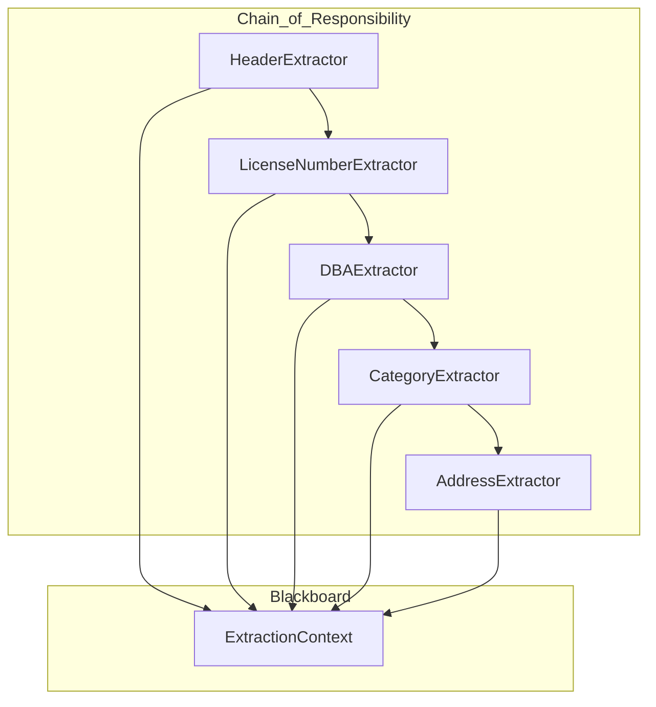

# Boston Licensing Board - Minutes to JSON Pipeline

This project provides a robust, highly efficient pipeline for extracting structured JSON data from PDF voting minutes issued by the City of Boston Licensing Board. It automates the transformation of unstructured legal records into actionable data using a pipeline-based architecture, a pluggable validation system, and precise regex-based extraction.

## 🏗 Architecture

The application is built around a sequential pipeline orchestrated by a central `Pipeline` class and supported by a State Manager (`KVStore`). This approach ensures that processing stages are decoupled, auditable, and easily extensible via plugins.

```mermaid
graph TD
    PDF["📄 PDF Voting Minutes"] --> PE["PDF Extractor Step"]
    PE --> KVS["📦 KVStore (State)"]
  
    KVS --> IP1["🔌 Invariant Plugins (Post-Text)"]
    IP1 -- "Regex Fixes" --> KVS
  
    KVS --> HE["Hearing Extractor Step"]
    HE -- "Identifies Section" --> KVS
  
    KVS --> IP2["🔌 Invariant Plugins (Post-Hearing)"]
    IP2 -- "Structure Cleanup" --> KVS
  
    KVS --> LE["License Text Extractor"]
    LE -- "Splits into Chunks" --> KVS
  
    KVS --> IP3["🔌 Invariant Plugins (Post-License)"]
    IP3 -- "Data Enrichment" --> KVS
  
    KVS --> TJE["Text-JSON Extractor"]
    TJE -- "Structured Fields" --> JSON["📊 all_licenses.json"]
```



## 🧩 Key Components

### 📦 State Management (`KVStore`)

The `KVStore` is the single source of truth. It holds intermediate states (raw text, hearing sections, metadata) refined by each step. It includes solid debugging tools like `dump(escape=True)` for deep inspection of PDF parsing artifacts.

### ⚙ Pipeline Steps

- **[PDFTextExtractorStep](./app/pipeline/extract_pdf_text.py)**: Converts binary PDF data into clean, ASCII-normalized text using PyMuPDF.
- **[HearingTextExtractorStep](./app/pipeline/extract_hearing.py)**: Isolates the "Transactional Hearing" section.
- **[LicenseTextExtractorStep](./app/pipeline/extract_license_text.py)**: Segments the hearing section into individual license entries with intelligent multi-license chunk handling.
- **[TextJsonExtractorStep](./app/pipeline/json_extractor.py)**: The final extraction engine. It orchestrates a specialized sub-pipeline of granular extractors.

### ⛓ Extraction Pipeline (Chain of Responsibility)

The `TextJsonExtractorStep` delegates the heavy lifting to a chain of specialized extractors. Each extractor is responsible for a specific subset of fields (e.g., DBA name, license number, address) and operates on a shared `ExtractionContext`.



This granular approach offers several benefits:

- **Isolation**: Changes to how addresses are parsed don't affect manager/attorney extraction, etc.
- **State Sharing**: Extractors use `anchors` in the context to mark locations in the text, allowing following extractors to resume from where the previous one left off.
- **Reliability**: A failure in one extractor doesn't halt the entire pipeline for a record.

### 🔌 Invariant Plugin System

The [InvariantPluginStep](./app/pipeline/invariant_plugins.py) dynamically loads and runs date-specific fixes at three critical stages:

1. **`POST_TEXT`**: Fixes OCR or numbering issues in the raw extracted text.
2. **`POST_HEARING`**: Cleans up specific structural anomalies in the hearing section.
3. **`POST_LICENSE`**: Validates or enriches individual license chunks before final JSON extraction.

### 📊 Statistics & Quality Reporting

The project includes a built-in analysis engine (**[app/utils/stats_report.py](./app/utils/stats_report.py)**) that tracks extraction quality across the entire dataset.

- **Field Completeness**: Measures how many records successfully extracted each of the 13 core fields.
- **Distribution Analysis**: Tracks categorical trends for hearing `status` and `alcohol_types`.
- **Automatic Reports**: An HTML report is automatically generated at the end of every directory batch run.

## 🚀 Usage

The project uses a dedicated CLI in `app/cli.py` for both batch processing and single-file debugging.

**Batch Process Directory:**

```bash
uv run python -m app.cli --dir voting_minutes_pdfs --output all_licenses.json
```

**Debug Single File:**
Processing a single file automatically triggers a full `KVStore` diagnostic dump, helping you identify why a specific document might be failing.

```bash
uv run python -m app.cli --file voting_minutes_pdfs/specific_file.pdf
```

**Using Makefile:**

```bash
# Run the whole directory
# Assumes --dir ../scrape/voting_minutes_pdfs
make run

# Run a single file
make run1 PDF=voting_minutes_2025-04-17.pdf
```

## 📊 Manual Validation & Data Exploration

For manual validation and data exploration of the license JSON data, `licenses_to_excel.py` converts the extracted license data into an Excel spreadsheet with automatic column formatting and sorting.

**View the output:**
The tool will generate or update `licenses.xlsx` (based on `all_licenses.json`) in the root of the transform directory. This Excel file is useful for:

- Auditing extraction accuracy.
- Filtering and sorting by business name, zip code, etc.
- Identifying missing or malformed data points.

## 💡 Benefits

- **Performance**: Strong regex processing (sub-second per document).
- **No External Dependencies**: Zero API calls and fully deterministic results.
- **Auditable**: Detailed state dumps allow for precise debugging of the extraction logic.
- **Extensible**: Add "violation plugins" by simply dropping a new Python file into the appropriate stage directory.
